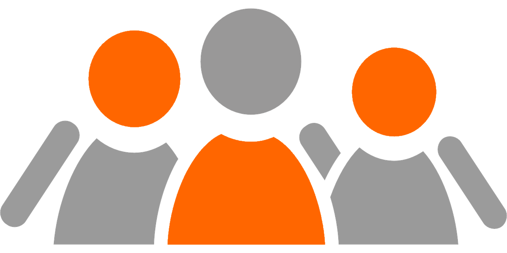

<!--
image source: https://pixabay.com/en/members-group-people-team-business-42919/
license: CC0
-->

<h2 class="big-title">Become a Member</h2>

<!-- Membership Entries Column -->
The current smarthome market suffers under the commercial interests and competition of big companies, which are fighting for customers and trying to push their proprietary ecosystems. This leads to a highly fragmented market with vendor lock-ins, making interoperability and extensibility a big challenge.

We believe that smart homes must not be closed or restricted, but that everyone should have the freedom to extend, modify and enhance it.

The openHAB Foundation e.V. was founded to boost innovation and to make open-source smart home technology easily available for everybody.
Our members support this idea and specifically believe that [openHAB](https://www.openhab.org/) has the potential to be a leading open-source smart home solution that is worth to be supported to build a counterweight to proprietary and closed solutions.

<router-link class="join-us-button" to="/members/">See who supports us already! ➜</router-link>

<h2 class="big-title">Join Us!</h2>

<!--  -->

When you become a member of the foundation, you are part of a passionate community, working together to shape the future for a better smart home world: Openness, neutrality, multi-vendor interoperability, full user control and flexibility, data privacy and open ecosystems — all built with Free software.

As a member, you do not only help financially to reach this goal, but you have also the possibility to take an active role in the foundation's endeavors and publish your own views and activities on the [openHAB Blog](https://www.openhab.org/blog/).

Join us on our journey to support and educate the world around us about the possibilities and benefits of free open smart home solutions and ecosystems.

<h2 class="big-title">Membership Types</h2>

    

        

            
        

        

            <h4>Sustaining Member</h4>
            
For people who just want to show their appreciation.

            2&euro;
            per month<a href="#fees">*</a>
            <a href="/forms/Membership-Application-Form-Individual.pdf" class="join-us-button" target="_blank">Join Now!</a>
        

    

    

        

            
        

        

            <h4>Ordinary Member</h4>
            
For individuals who want to support financially or to actively engage themselves.

            10&euro;
            per month<a href="#fees">*</a>
            <a href="/forms/Membership-Application-Form-Individual.pdf" class="join-us-button" target="_blank">Join Now!</a>
        

    

    

        

            
        

        

            <h4>Legal Entity</h4>
            
For companies and organisations that share our vision.

            50&euro;
            per month<a href="#fees">*</a>
            <a href="/forms/Membership-Application-Form-LegalEntity.pdf" class="join-us-button">Join Now!</a>
        

    

* _plus a one-time admission fee of 10 EUR_. Please see our membership fees for further details:

- [Beitragsordnung (German)](/legal/Beitragsordnung_2016-05-20.pdf) - the legally binding document
- [Membership Fees (English)](/legal/MembershipFees_2016-05-20.pdf) - for information only

::: tip NOTE

Membership fees are fully tax deductible for German residents as we are an officially recognized non-profit association (*gemeinnütziger Verein*).

:::

